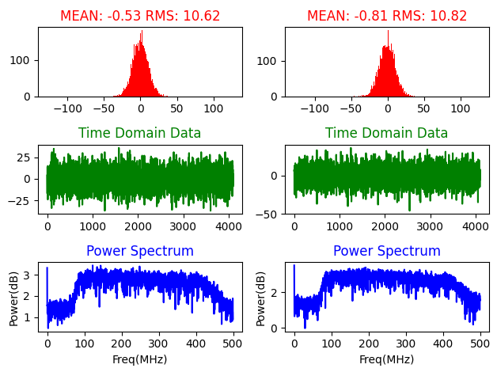

# RMS calcluation for SERENDIP6
Before we start observations, we need to check the Root Mean Square(RMS) values of the raw adc data, and make sure the RMS values are around 20.  
Normally, we can connect to the ROACH2 board, and get some raw adc data from the ROACH2 board for RMS checking. However, it's impossible to connect to the ROACH2 board without knowing the IP address of the board.  
The script is used for checking RMS from 10GbE ports, which connect to SERENDIP6 servers.
## Getting start
1. Required python packages
    ```
    pip install numpy
    pip install matplotlib
    pip install scipy
    ```
2. set the beam numer and eth ports in rms.sh
    ```
    beam=0
    eth0=enp216s0f0
    eth1=enp216s0f1
    ```
    **Note:** `beam` starts from **0** in the script, but it starts from **1** in the FPGA configuration.
## Run the script
1. run `./rms.sh`
    ```
    $ ./rms.sh 
    ****************************************
    receiving multicast packets from pol0...
    receiving multicast packets from pol1...
    ****************************************
    Pol0 -  Mean: -0.54; RMS: 10.42
    Pol1 -  Mean: -0.81; RMS: 11.36
    done.
    ****************************************
    ```
2. If you want to see a figure, you can run  
    (Please use `ssh -XY xx@xxx` to log into your server.)
    ```
    $ ./rms.sh --show
    ****************************************
    receiving multicast packets from pol0...
    receiving multicast packets from pol1...
    ****************************************
    Pol0 -  Mean: -0.57; RMS: 10.41
    Pol1 -  Mean: -0.80; RMS: 10.38
    plotting data...
    done.
    ****************************************
    ```
    You will see a figure show up in a few seconds.
    If you add **"--savefig"** option, the figure will be saved with a name of timestamp.
3. You can also save the data into files for further analysis.
    ```
    $ ./rms.sh --save
    ****************************************
    receiving multicast packets from pol0...
    receiving multicast packets from pol1...
    ****************************************
    Pol0 -  Mean: -0.63; RMS: 10.24
    Pol1 -  Mean: -0.76; RMS: 11.63
    done.
    ****************************************
    ```
    You will see two npz files generated in the same directory. You can use `numpy.load()` to load the data.
## More info
* The `rms.sh` script is based on `multicastpacketcapture.py`. You can run `python multicastpacketcapture.py -h` to get more information.
    ```
    usage: multicastpacketcapture.py [-h] [--lip0 LIP0] [--mip0 MIP0] [--lip1 LIP1] [--mip1 MIP1] [--mport MPORT] [--save] [--show]

    Check adc data from a multicast receiver.

    optional arguments:
    -h, --help     show this help message and exit
    --lip0 LIP0    local ip address of pol0.
    --mip0 MIP0    multicast group ip address of pol0.
    --lip1 LIP1    local ip address of pol1.
    --mip1 MIP1    multicast group ip address of pol1.
    --mport MPORT  multicast port.
    --save         save data to file.
    --show         show the plot.
    ```
